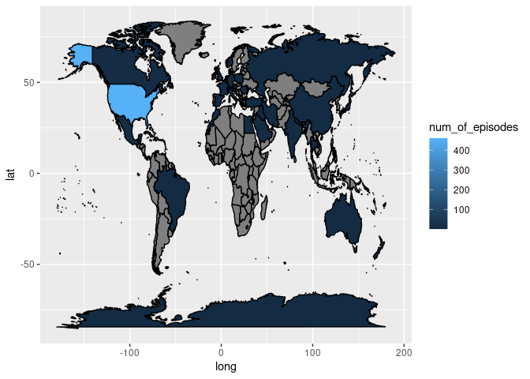

Scooby-Doo
================
Sara Knight, Alexa Kraklau
2/23/2022

l

``` r
library(tidyverse)
```

    ## ── Attaching packages ─────────────────────────────────────── tidyverse 1.3.1 ──

    ## ✓ ggplot2 3.3.4     ✓ purrr   0.3.4
    ## ✓ tibble  3.1.2     ✓ dplyr   1.0.7
    ## ✓ tidyr   1.1.3     ✓ stringr 1.4.0
    ## ✓ readr   1.4.0     ✓ forcats 0.5.1

    ## ── Conflicts ────────────────────────────────────────── tidyverse_conflicts() ──
    ## x dplyr::filter() masks stats::filter()
    ## x dplyr::lag()    masks stats::lag()

``` r
scoobydoo <- readr::read_csv('https://raw.githubusercontent.com/rfordatascience/tidytuesday/master/data/2021/2021-07-13/scoobydoo.csv')
```

    ## 
    ## ── Column specification ────────────────────────────────────────────────────────
    ## cols(
    ##   .default = col_character(),
    ##   index = col_double(),
    ##   date_aired = col_date(format = ""),
    ##   run_time = col_double(),
    ##   monster_amount = col_double(),
    ##   unmask_other = col_logical(),
    ##   caught_other = col_logical(),
    ##   caught_not = col_logical(),
    ##   suspects_amount = col_double(),
    ##   culprit_amount = col_double(),
    ##   door_gag = col_logical(),
    ##   batman = col_logical(),
    ##   scooby_dum = col_logical(),
    ##   scrappy_doo = col_logical(),
    ##   hex_girls = col_logical(),
    ##   blue_falcon = col_logical()
    ## )
    ## ℹ Use `spec()` for the full column specifications.

``` r
scoobycleaned<-scoobydoo[!(scoobydoo$monster_name=="NULL" & scoobydoo$monster_type=="NULL"),]
```

| Header                     | Description                                  |
|:---------------------------|:---------------------------------------------|
| `index`                    | Index ordering based on Scoobypedia (dbl)    |
| `series_name`              | Name of Series (char)                        |
| `network`                  | TV Network TV series takes place in (char)   |
| `season`                   | Season of TV Series (char)                   |
| `title`                    | Title of Show/Movie (char)                   |
| `imbd`                     | Score on IMBD (char)                         |
| `engagment`                | Number of Reviews on IMBD (char)             |
| `date_aired`               | Date aired in US (dbl)                       |
| `run_time`                 | Run time in min (dbl)                        |
| `format`                   | Type of media (char)                         |
| `monster_name`             | Name of monster (char)                       |
| `monster_gender`           | Binary monster gender (char)                 |
| `monster_type`             | Monster type (char)                          |
| `monster_subtype`          | Monster subtype (char)                       |
| `monster_species`          | Monster species (char)                       |
| `monster_real`             | Was monster real (char)                      |
| `monster_amount`           | Monster amount (dbl)                         |
| `caught_fred`              | Caught by Fred (char)                        |
| `caught_daphnie`           | Caught by Daphnie (char)                     |
| `caught_velma`             | Caught by Velma (char)                       |
| `caught_shaggy`            | Caught by Shaggy (char)                      |
| `caught_scooby`            | Caught by Scooby (char)                      |
| `captured_fred`            | Captured Fred (char)                         |
| `captured_daphnie`         | Captured Daphnie (char)                      |
| `captured_velma`           | Captured Velma (char)                        |
| `captured_shaggy`          | Captured Shaggy (char)                       |
| `captured_scooby`          | Captured Scooby (char)                       |
| `unmask_fred`              | Unmasked by Fred (char)                      |
| `unmask_daphnie`           | Unmasked by Daphnie (char)                   |
| `unmask_velma`             | Unmasked by Velma (char)                     |
| `unmask_shaggy`            | Unmasked by Shaggy (char)                    |
| `unmask_scooby`            | Unmasked by Scooby (char)                    |
| `snack_fred`               | Snack eaten by Fred (char)                   |
| `snack_daphnie`            | Snack eaten by Daphnie (char)                |
| `snack_velma`              | Snack eaten by Velma (char)                  |
| `snack_shaggy`             | Snack eaten by Shaggy (char)                 |
| `snack_scooby`             | Snack eaten by Scooby (char)                 |
| `unmask_other`             | Unmasked by other (chat)                     |
| `caught_other`             | Caught by other (char)                       |
| `caught_not`               | Not caught (logical)                         |
| `trap_work_first`          | Trap worked first time (char)                |
| `caught_shaggy`            | Caught by Shaggy (char)                      |
| `setting_terrain`          | Setting type of terrain (char)               |
| `setting_country_state`    | Setting Country State (char)                 |
| `suspect_amount`           | Suspect amount (dbl)                         |
| `non_suspect`              | Non suspect (char)                           |
| `arrested`                 | Arrested (char)                              |
| `culprit_name`             | Culprit name (char)                          |
| `culprit_gender`           | Culprit binary gender(char)                  |
| `culprit_amount`           | Culprit amount (dbl)                         |
| `motive`                   | Motive (char)                                |
| `if_it_wasn't_for`         | Phrase at end the of the show (char)         |
| `door_gag`                 | Door gag happened (logical)                  |
| `number_of_snacks`         | Number of snacks (char)                      |
| `split_up`                 | Did they split up (char)                     |
| `another_mystery`          | Another mystery (char)                       |
| `set_a_trap`               | Did they set a trap (char)                   |
| `jeepers`                  | Times “Jeepers” said (char)                  |
| `jinkies`                  | Times “Jinkies” said (char)                  |
| `my_glasses`               | Times “My glasses” said (char)               |
| `just_about_wrapped_up`    | Times “Just about wrapped up” said (char)    |
| `zoinks`                   | Times “Zoinks” said (char)                   |
| `groovy`                   | Times “Groovy” said (char)                   |
| `scooby_doo_where_are_you` | Times “Scooby doo where are you” said (char) |
| `rooby_rooby_roo`          | Times “Rooby rooby roo” said (char)          |
| `batman`                   | Batman in episode (logical)                  |
| `scooby_dum`               | Scooby Dum in episode (logical)              |
| `scrappy_do`               | Scrappy Doo in episode (logical)             |
| `hex_girls`                | Hex Girls in episode (logical)               |
| `blue_falcon`              | Blue Falcon in episode (logical)             |
| `fred_va`                  | Fred voice actor (char)                      |
| `daphnie_va`               | Daphnie voice actor (char)                   |
| `velma_va`                 | Velma voice actor (char)                     |
| `shaggy_va`                | Shaggy voice actor (char)                    |
| `scooby_va`                | Scooby voice actor (char)                    |

**Ideas** 1. color-coordinated 2. pull fonts from the internet 5. Keep
the movies/ Get rid of the movies? 6. What do they mean by crossover?

**Questions**

1.  How did the average running time of Scooby-Doo change?

``` r
scoobydoo %>% 
  ggplot(mapping = aes(x = season, y = run_time))+
    geom_boxplot()
```

<!-- --> What
is up with season 2?

``` r
scoobydoo %>% 
  ggplot(mapping = aes(x = index, y = imdb))+
  geom_point()
```

<!-- -->

At the very start it looks like they were highly rated. Then it almost
stabilized a little. Finally all over the place. Where I would go next
is how well are the movies rated compared to shows or crossovers.

``` r
scoobycleaned %>% 
  ggplot(mapping = aes(y = season, x = caught_fred))+
  geom_bar(stat = "identity", fill = "light blue")
```

<!-- -->

This is just me playing around with color and trying to graph things.

``` r
scoobycleaned %>% 
    ggplot(mapping = aes(y = season, x = captured_fred))+
  geom_bar(stat = "identity", fill = "light blue")
```

<!-- -->

Fred captures the monster only slightly more than getting caught. Get
rid of null?

``` r
scoobycleaned %>% 
  ggplot(mapping = aes(y = season, x = caught_daphnie))+
  geom_bar(stat = "identity", fill = "purple")
```

<!-- -->
Daphnie almost never caught the monster.

``` r
scoobycleaned %>% 
  ggplot(mapping = aes(y = season, x = captured_daphnie))+
  geom_bar(stat = "identity", fill = "purple")
```

<!-- -->
However she got caught less than I thought (I tried light purple and it
didn’t work)

``` r
scoobycleaned %>% 
  ggplot(mapping = aes(y = season, x = caught_velma))+
  geom_bar(stat = "identity", fill = " dark orange")
```

<!-- -->

Velma was a little more sucessful than Daphnie, but not much

``` r
scoobycleaned %>% 
  ggplot(mapping = aes(y = season, x = captured_velma))+
  geom_bar(stat = "identity", fill = "dark orange")
```

<!-- -->
Looks to close to Daphnie. (I couldn’t use light orange)

``` r
scoobycleaned %>% 
  ggplot(mapping = aes(y = season, x = caught_shaggy))+
  geom_bar(stat = "identity", fill = "light green")
```

<!-- -->

Now I’m confused about what null would mean. My first thought would be
the episodes where Shaggy wasn’t in them, but that doesn’t make sense.

``` r
scoobycleaned %>% 
  ggplot(mapping = aes(y = season, x = captured_shaggy))+
  geom_bar(stat = "identity", fill = "light green")
```

<!-- -->

Less than Velma and Daphnie, but more than Fred.

``` r
scoobycleaned %>% 
  ggplot(mapping = aes(y = season, x = caught_scooby))+
  geom_bar(stat = "identity", fill = "tan")
```

<!-- -->

I’m kinda suprised, kinda not that Scooby caught the most monsters.

``` r
scoobycleaned %>% 
  ggplot(mapping = aes(y = season, x = captured_scooby))+
  geom_bar(stat = "identity", fill = "tan")
```

<!-- -->

``` r
ggplot(data=scoobydoo, aes(x=monster_real, fill=monster_real)) +
    geom_bar(colour="blue", stat="Count") +
    guides(fill=FALSE)
```

    ## Warning: `guides(<scale> = FALSE)` is deprecated. Please use `guides(<scale> =
    ## "none")` instead.

<!-- -->

``` r
ggplot(data = scoobydoo, aes(x = captured_scooby, y = season, fill = season)) +
  geom_bar(stat = "Identity", position = position_dodge(), alpha = 0.75) 
```

<!-- -->

This was me just messing around and trying to figure out some big
questions we can explore.

``` r
scoobydoo_tv <- scoobydoo %>% 
  filter(format == "TV Series")

scoobydoo_tv_segmented <- scoobydoo %>% 
  filter(format == "TV Series (segmented)")

scoobydoo_crossover <- scoobydoo %>%
  filter(format == "Crossover")

scoobydoo_movie <- scoobydoo %>% 
  filter(format == "Movie")
```

``` r
scoobydoo_where_are_you <- scoobydoo %>% 
  filter(series_name == "Scooby Doo, Where Are You!")
scoobydoo_the_new_scoobydoo_movies <- scoobydoo_tv %>% 
  filter(series_name == "The New Scooby-Doo Movies")
the_scoobydoo_show <- scoobydoo %>% 
  filter(series_name == "The Scooby-Doo Show" )
scoobydoo_and_scrappydoo <- scoobydoo %>% 
  filter(series_name == "Scooby-Doo and Scrappy-Doo (first series)")
new_scoobydoo_and_scrappydoo_show <- scoobydoo %>% 
  filter(series_name == "The New Scooby and Scrappy Doo Show")
```
